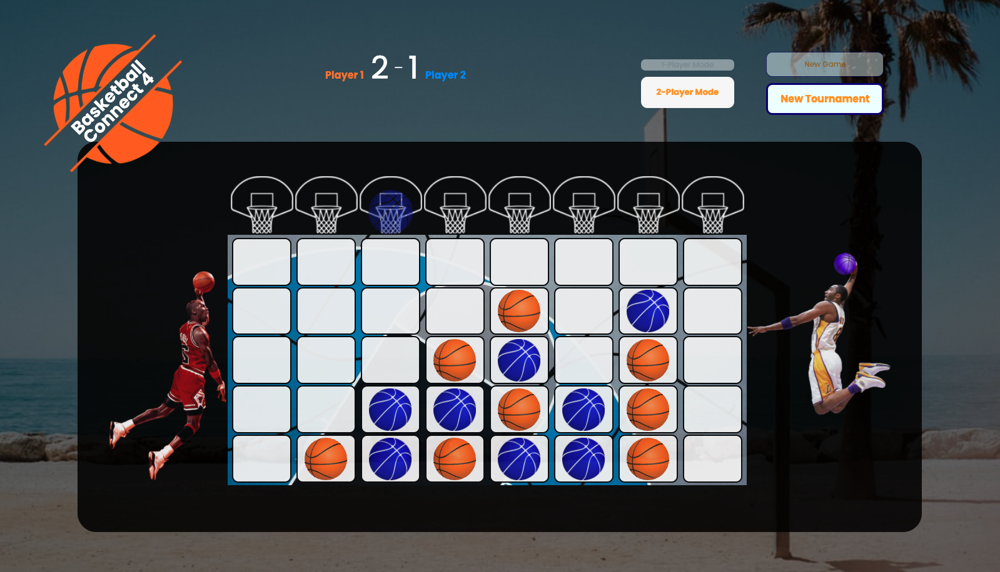
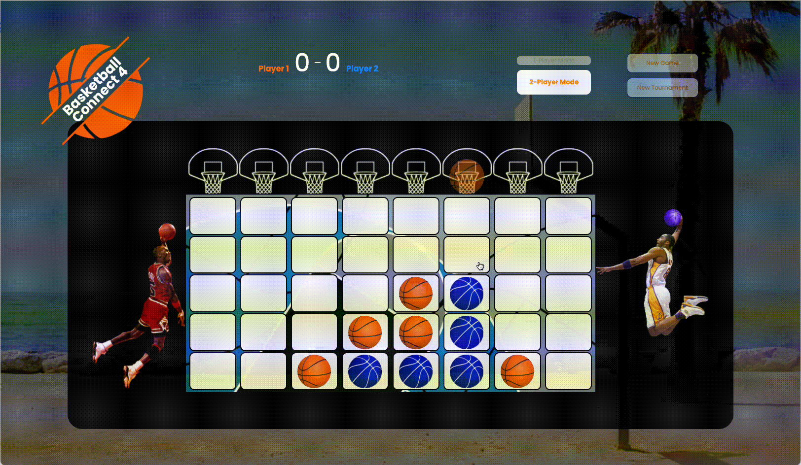

# Basketball Connect 4
The traditional Connect Four game with a basketball twist. [Play it here!](https://emilydaykin.github.io/Basketball-Connect4/)



## Game walkthrough:
### Landing Page:
<p align="center">
  
</p>

### 1-player vs 2-player mode:
<p align="center">
  
   
</p>

### Win Condition:
<p align="center">
   
</p>

## Tech Stack used:
HTML, CSS and vanilla Javascript; Git; GitHub Pages for deployment.


## Game Features:
### MVP (v0):
- ✔️  A working game of connect 4 (with correct logic to check for a win) in an 8x5 grid.
- ✔️  The counters will be orange and blue basketballs.
- ✔️   The balls going into the grid are animated to slide down the grid, rather than just appear in the correct cell.
- ✔️ '2-player' mode and a '1-player v computer' mode. Computer will not be intelligent, will only be randomised moves.
- ✔️ Scoring: multiple games within a tournament (game score & tournament score).
- ✔️ Buttons: start new game, or start new tournament (scoreboard (tracks game wins) is only cleared after new tournament starts).

### Version 1 (v1):
- ✖️ Animation of ball being shot (a perfect arc) from player images to the selected column of the grid.
- ✔️ Hoop & backboard images above each column.
- ✖️ Swish sound when each ball goes in each column (didn't like the effect in the end).
- ✔️ Grid background will be a basketball court on page load, then each cell will appear to fill out the grid.
- ✔️ Either side of the grid will display player images (MJ/Kobe/Lebron) shooting. For the 1-player mode, one of the players will be a silhouette shooting.
- ✔️ Computer to make calculated moves rather than random ones.

### V2:
- Users select which hoop they want to drop the ball down via clicking on the players.
- The longer users hold down the click for, the further the ball shoots.


## Code Base:
- Entire game functionality wrapped in a class.
### Tree:

```
.
├── index.html
├── game.html
├── styles
│   ├── main.css
│   └── start.css
└── scripts
    ├── app.js
    ├── start.js
    └── components
        ├── game.js
        └── gridOverview.js
```

## Approach Taken:
- Pseudocoded 90% the JS before beginning any coding (comments in app.js and excalidraw). The 10% with event listeners interacting were too complicated to picture without any code, so that part was figured out along the way.
- Minimal HTML and CSS to begin with; prioritised JS.
- Had a functioning version of the game in JS first before doing a whole codebase refactor into classes.

## Project Overview:
- **Day 1 (Fri)**: All day pseudocoding and whiteboarding JS logic. Browsed game images.
- **Day 2-3 (Sat-Sun)**: Coded up logic, event listeners, scoring system, 2-player & 1-player modes.
- **Day 4 (Mon)**: Added ball slide animation with `setInterval`, and fixed bugs all day.
- **Day 5 (Tues)**: Refactoring JS into classes and styling.
- **Day 6 (Weds)**: Responsive design and more styling (added new start page upon browser load).
- **Day 7 (Thurs)**: Attemping the shot arc; adding a tiny bit of AI to the 1-player game, and cleaning up code.

## Bugs:
- If mouse is inside grid as the grid is fading in, ball hover over the hoops will be opaque, rather than translucent as it should be. (Once mouse leaves grid, and comes back in, styling works.)

## Wins & Ideals:
### Wins:
- Refactored code base into classes, keeping the functions and methods organised and compartmentalised. 
- `setInterval` challenges overcome: working animation and then embedded in a class.
- Foolproof logic to check for a winner of the game.

### Ideals:
- Animate each turn to have the ball shooting from the players' hands to each corresponding hoop clicked on (shot arc before sliding down each column).
- Computer AI to be even smarter.
- More responsive design to allow for mobile/tablet mode.
